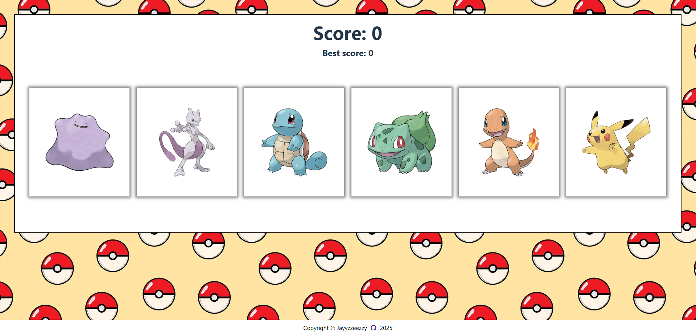

# Memory Card

## Description

A memory card game made with React.

The purpose of this web app is to go deeper into the React framework by incorporating State and Effect variables and other best practices in React.

Backend is provided by the [Pokemon API](https://pokeapi.co/).

## Features

- State and Effect implementation
- RESTful API

## Installation

1. **Fork the Repository**

    - Follow the documentation on GitHub to [fork this repository](https://docs.github.com/en/pull-requests/collaborating-with-pull-requests/working-with-forks/fork-a-repo).  

    - You should also have a local clone of the forked repository after following the tutorial.

2. **Move to the cloned directory**

    ``cd memory-card``

3. **Install Dependencies**

    ``npm install``

4. **Start the project**

    ``npm run dev``

## Contribute

- Issue Tracker: github.com/jayyzzeezzy/memory-card/issues
- Source Code: github.com/jayyzzeezzy/memory-card.git

## Support

Let me know if you encounter any issues.  
Email me at: <jam9es@gmail.com>

## License

The project is licensed under the [MIT license](LICENSE.md).
